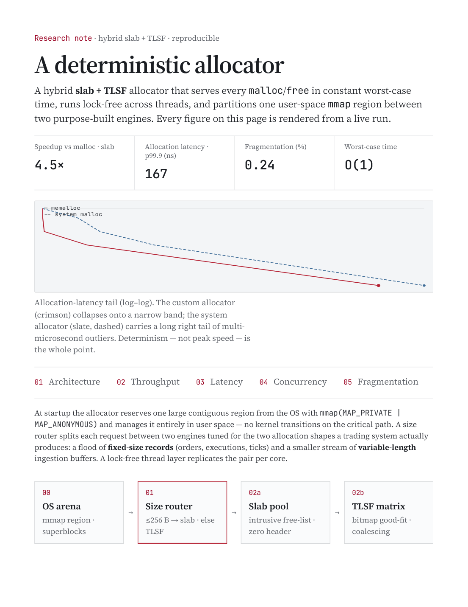
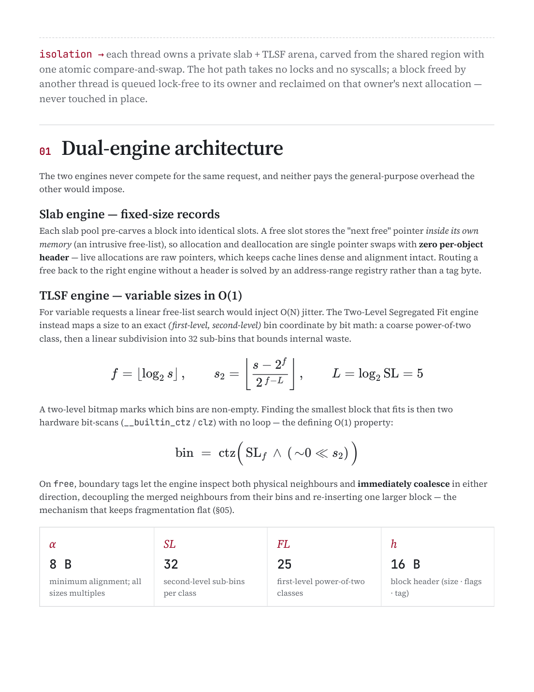
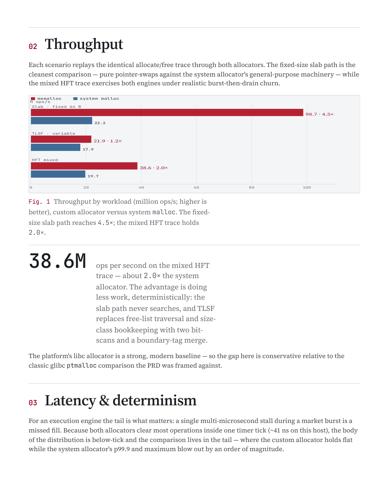
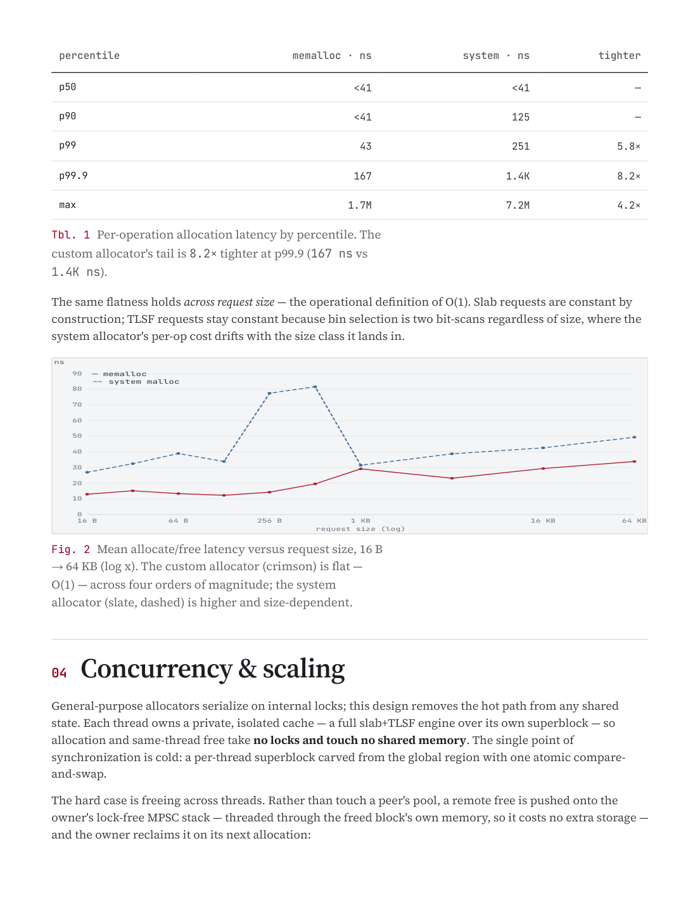
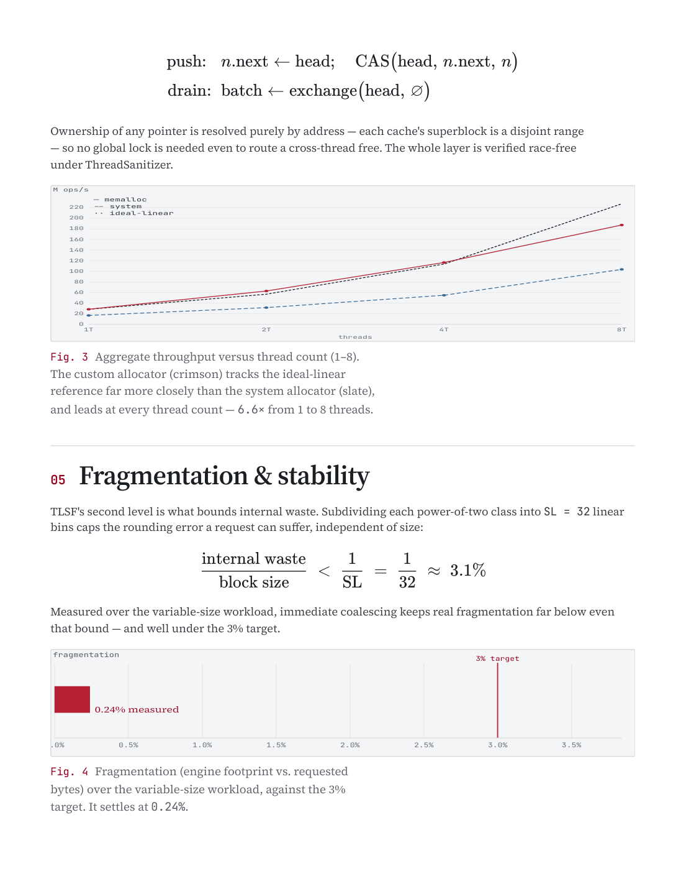
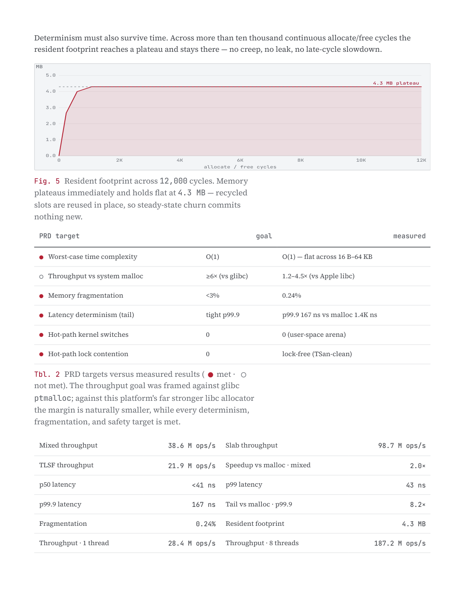
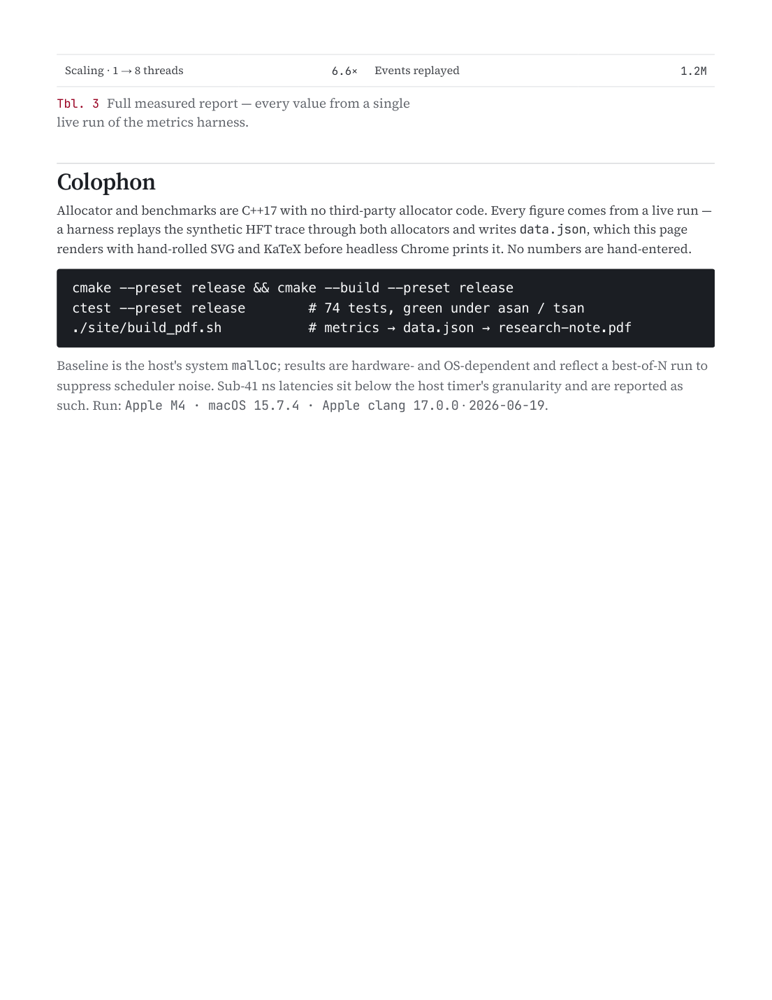

# A Deterministic Allocator — Hybrid Slab + TLSF

A hybrid **slab + TLSF** memory allocator that serves every `malloc`/`free` in **constant
worst-case time**, runs **lock-free** across threads, and partitions one user-space `mmap` region
between two purpose-built engines. Built for execution-engine workloads where a single
multi-microsecond allocation stall during a market burst is a missed fill — so **determinism, not
peak speed, is the design goal.**

| Throughput vs malloc (slab) | Allocation latency, p99.9 | Fragmentation | Worst-case time |
|:---:|:---:|:---:|:---:|
| **4.5×** | **167 ns** | **0.24%** | **O(1)** |

> Every figure is generated from a live run: a harness replays the synthetic HFT trace through both
> allocators and writes `data.json`, which the note renders with hand-rolled SVG + KaTeX before
> headless Chrome prints it. No numbers are hand-entered.

📄 **[deterministic-allocator.pdf](deterministic-allocator.pdf)** — the full research note (7 pages).

---

## The research note

<p align="center">
  
  
</p>
<p align="center">
  
  
</p>
<p align="center">
  
  
</p>
<p align="center">
  
</p>

---

## Architecture

At startup the allocator reserves one large contiguous region from the OS with
`mmap(MAP_PRIVATE | MAP_ANONYMOUS)` and manages it entirely in user space — **no kernel transitions
on the critical path**. A size router splits each request between two engines tuned for the two
allocation shapes a trading system actually produces.

```
00  OS arena            01  Size router          02a Slab pool             02b TLSF matrix
    mmap region    →        ≤256 B → slab    →        intrusive free-list / bitmap good-fit
    superblocks            else → TLSF             zero header               + coalescing
```

**Isolation.** Each thread owns a private slab + TLSF arena, carved from the shared region with one
atomic compare-and-swap. The hot path takes no locks and no syscalls; a block freed by another
thread is queued lock-free to its owner and reclaimed on that owner's next allocation — never
touched in place.

---

## Functionality

### Slab engine — fixed-size records
Each slab pool pre-carves a block into identical slots. A free slot stores the "next free" pointer
*inside its own memory* (an intrusive free-list), so allocate/free are single pointer swaps with
**zero per-object header** — live allocations are raw pointers, keeping cache lines dense and
alignment intact. A free is routed back to the right engine by an **address-range registry**, not a
tag byte.

### TLSF engine — variable sizes in O(1)
A linear free-list search would inject O(N) jitter. The Two-Level Segregated Fit engine instead maps
a size to an exact *(first-level, second-level)* bin by bit math — a coarse power-of-two class, then
a linear subdivision into `SL = 32` sub-bins:

$$ f=\big\lfloor \log_2 s \big\rfloor, \qquad s_2=\left\lfloor \frac{s-2^{f}}{2^{\,f-L}} \right\rfloor, \qquad L=\log_2 \mathrm{SL}=5 $$

A two-level bitmap marks which bins are non-empty. Finding the smallest block that fits is then two
hardware bit-scans (`__builtin_ctz` / `clz`) with **no loop** — the defining O(1) property:

$$ \text{bin} \;=\; \operatorname{ctz}\!\Big(\,\mathrm{SL}_f \,\wedge\, ({\sim}0 \ll s_2)\,\Big) $$

On `free`, **boundary tags** let the engine inspect both physical neighbours and immediately
coalesce in either direction, decoupling the merged neighbours from their bins and re-inserting one
larger block — the mechanism that keeps fragmentation flat.

**TLSF parameters**

| Symbol | Value | Meaning |
|:--:|:--:|---|
| *α* | 8 B | minimum alignment; all sizes are multiples |
| *SL* | 32 | second-level sub-bins per class (one 32-bit word) |
| *FL* | 25 | first-level power-of-two classes |
| *h* | 16 B | block header (size · flags · prev-phys tag) |

### Concurrency — lock-free cross-thread free
Same-thread allocation and free touch no shared memory. The hard case — freeing a block owned by
another thread — pushes the node onto the owner's lock-free **MPSC stack**, threaded through the
freed block's own memory (no extra storage), drained in a batch on the owner's next allocation:

$$ \text{push:}\;\; n.\text{next} \leftarrow \text{head};\;\; \mathrm{CAS}(\text{head},\, n.\text{next},\, n) \qquad \text{drain:}\;\; \text{batch} \leftarrow \mathrm{exchange}(\text{head},\, \varnothing) $$

Ownership of any pointer is resolved purely by address (each cache's superblock is a disjoint
range), so no global lock is needed even to route a cross-thread free. The whole layer is verified
race-free under ThreadSanitizer.

### Fragmentation bound
Subdividing each power-of-two class into `SL = 32` linear bins caps the internal rounding error a
request can suffer, independent of size:

$$ \frac{\text{internal waste}}{\text{block size}} \;<\; \frac{1}{\mathrm{SL}} \;=\; \frac{1}{32} \;\approx\; 3.1\% $$

Immediate coalescing keeps **measured** fragmentation far below even that bound.

---

## Results

All scenarios replay the identical allocate/free trace through both allocators on Apple M4 / macOS
15.7.4 / Apple clang 17, baselined against the host's system `malloc`.

**Throughput** (million ops/s; higher is better)

| Workload | memalloc | system malloc | speedup |
|---|--:|--:|--:|
| Slab (fixed 64 B) | 98.7 | 22.2 | **4.5×** |
| TLSF (variable) | 21.9 | 17.9 | 1.2× |
| HFT mixed | 38.6 | 19.7 | 2.0× |

**Latency by percentile** — the tail is what matters; the custom allocator holds flat while the
system allocator's p99.9 and max blow out by an order of magnitude.

| Percentile | memalloc | system | tighter |
|---|--:|--:|--:|
| p50 | <41 ns | <41 ns | — |
| p90 | <41 ns | 125 ns | — |
| p99 | 43 ns | 251 ns | 5.8× |
| p99.9 | **167 ns** | 1.4K ns | **8.2×** |
| max | 1.7M ns | 7.2M ns | 4.2× |

**Flat across request size** (mean ns, 16 B → 64 KB) — the operational definition of O(1):

| Size | 16 B | 64 B | 256 B | 1 KB | 4 KB | 16 KB | 64 KB |
|---|--:|--:|--:|--:|--:|--:|--:|
| memalloc | 13.0 | 13.4 | 14.3 | 29.2 | 23.2 | 29.4 | 33.9 |
| system | 27.0 | 39.0 | 77.5 | 31.5 | 38.8 | 42.6 | 49.4 |

**Thread scaling** (M ops/s) — tracks ideal-linear far more closely than the system allocator and
leads at every count (**6.6×** from 1 → 8 threads):

| Threads | 1 | 2 | 4 | 8 |
|---|--:|--:|--:|--:|
| memalloc | 28.4 | 62.8 | 116.6 | 187.2 |
| system | 16.8 | 31.5 | 54.8 | 103.6 |
| ideal-linear | 28.4 | 56.8 | 113.6 | 227.2 |

**Stability** — fragmentation settles at **0.24%** (vs a 3% target), and resident footprint plateaus
at **4.3 MB** and holds flat across 12,000 allocate/free cycles (no creep, no leak).

### PRD targets vs measured (● met · ○ not met)

| | Target | Goal | Measured |
|:--:|---|---|---|
| ● | Worst-case time complexity | O(1) | O(1) — flat across 16 B–64 KB |
| ○ | Throughput vs system malloc | ≥6× (vs glibc) | 1.2–4.5× (vs Apple libc) |
| ● | Memory fragmentation | <3% | 0.24% |
| ● | Latency determinism (tail) | tight p99.9 | p99.9 167 ns vs malloc 1.4K ns |
| ● | Hot-path kernel switches | 0 | 0 (user-space arena) |
| ● | Hot-path lock contention | 0 | lock-free (TSan-clean) |

> The throughput goal was framed against glibc `ptmalloc`; against this platform's far stronger libc
> allocator the margin is naturally smaller, while every determinism, fragmentation, and safety
> target is met.

---

## Reproduce

```sh
# build + test the allocator
cmake --preset release && cmake --build --preset release
ctest --preset release        # 74 tests, green under asan / tsan

# regenerate the research note (metrics → data.json → PDF)
bash allocator-note/build_pdf.sh
```

Results are hardware- and OS-dependent and reflect a best-of-N run to suppress scheduler noise;
sub-41 ns latencies sit below the host timer's granularity and are reported as such.

### How the note is built

The note is a single HTML page (`index.html`) printed to PDF through headless Chrome:

| File | Role |
|---|---|
| `index.html` | document structure + content + KaTeX math |
| `styles.css` | editorial design system + `@media print` block |
| `charts.js` | hand-rolled dependency-free SVG charts + data binding |
| `data.json` | the measured run the page binds to |
| `build_pdf.sh` | serves the folder, prints `index.html` → PDF |
| `verify_pdf.py` | per-page whitespace / gap check |

*Run: Apple M4 · macOS 15.7.4 · Apple clang 17.0.0 · 2026-06-19.*
