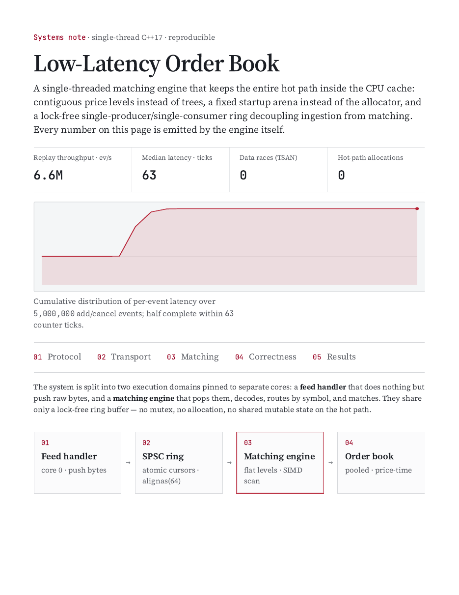
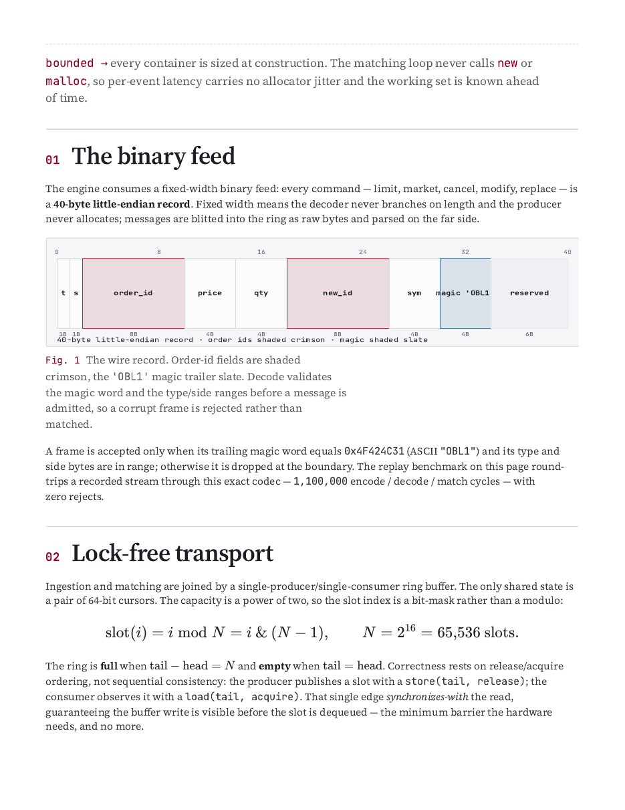
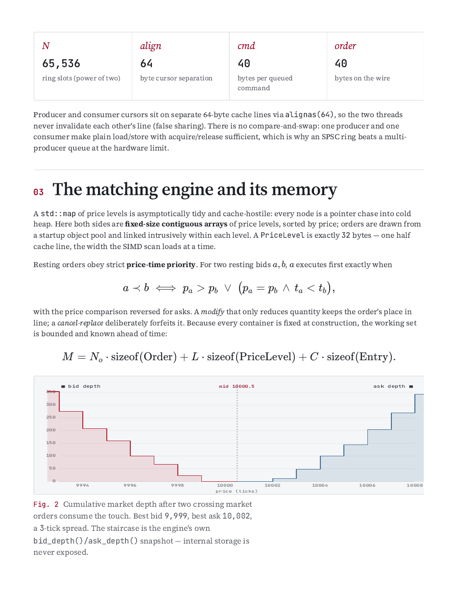
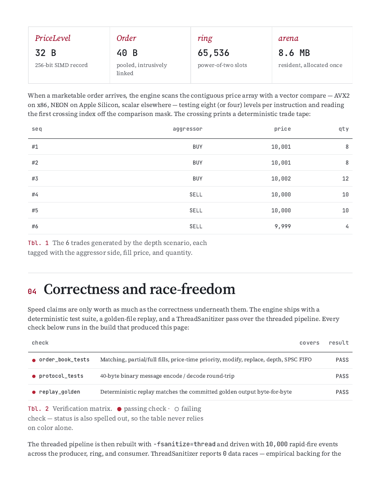
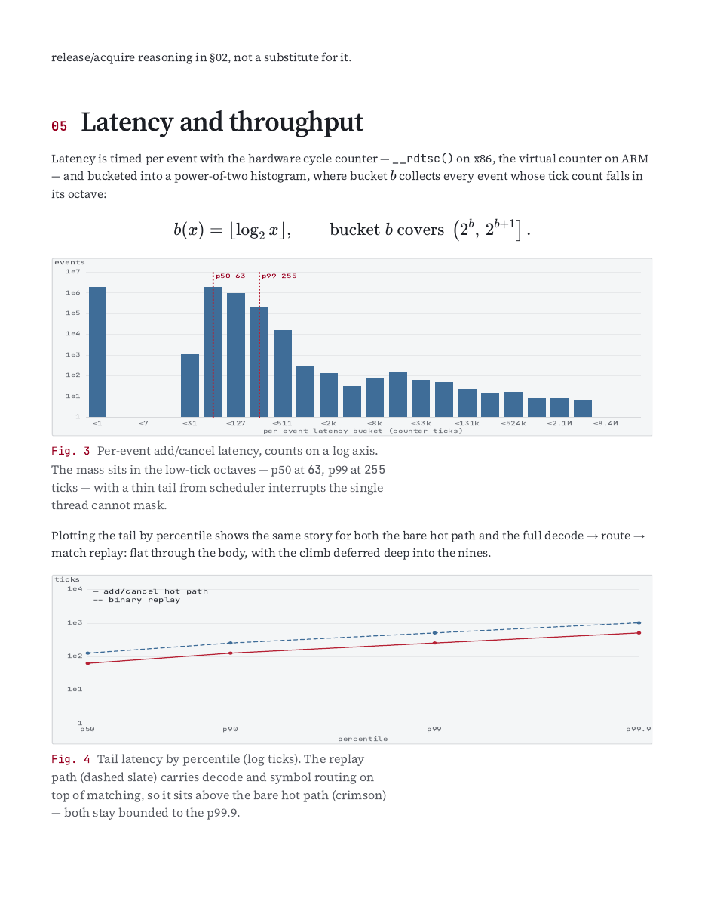
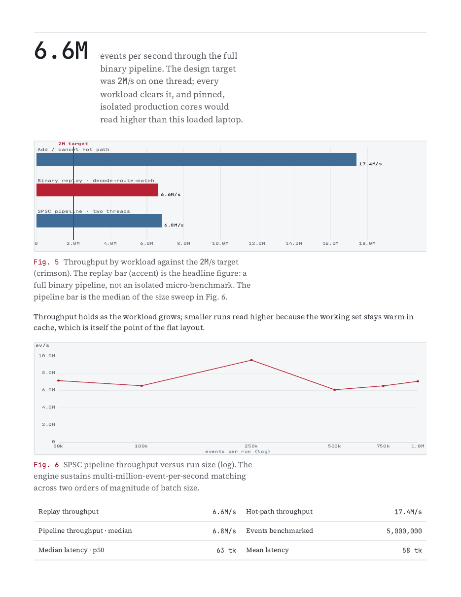
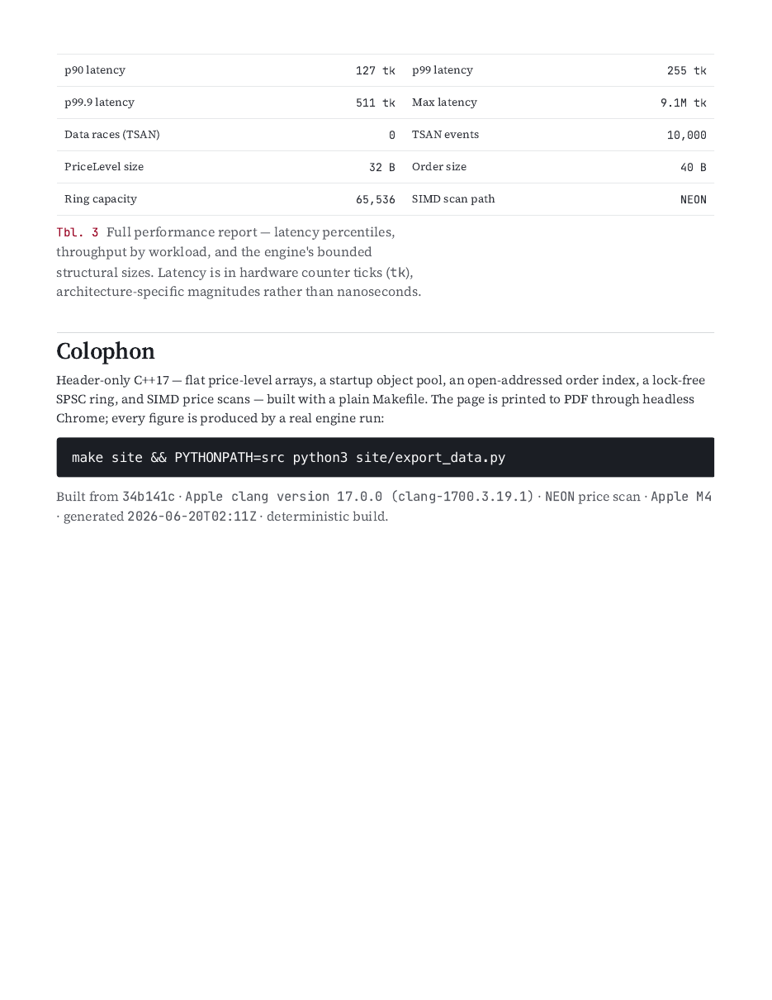

# Monte Carlo Options Pricing Engine

A high-performance, multi-threaded options pricing engine in **C++17** with a
zero-copy **Python** wrapper (pybind11). It prices European and American options
through three independent, cross-validating paradigms — so every number is
checkable against the other two.

---

## Showcase report

A single-page research note — **[`site/monte-carlo-options-pricer.pdf`](site/monte-carlo-options-pricer.pdf)** —
walks through all four engines with figures rendered entirely from a live run of
the engine (`site/export_data.py`). The eight pages:

| | |
|:---:|:---:|
|  |  |
|  |  |
|  |  |
|  |  |

Regenerate (re-runs the engine, then prints via headless Chrome):

```bash
bash site/build_pdf.sh
```

---

```
                  ┌─────────────────────────────────────────┐
                  │          Options Pricing Engine          │
                  └────────────────────┬────────────────────┘
                                       │
         ┌─────────────────────────────┼─────────────────────────────┐
         ▼                             ▼                             ▼
┌──────────────────┐         ┌──────────────────┐         ┌──────────────────┐
│ Analytic Engine  │         │ Lattice Engine   │         │ Simulation Engine│
│ (Black-Scholes)  │         │ (Binomial Tree)  │         │ (Monte Carlo)    │
└──────────────────┘         └──────────────────┘         └──────────────────┘
```

| | |
|---|---|
| **Throughput** | ~54M paths/sec (C++), 105M/sec via the Python quasi-MC path (10 cores) |
| **Latency** | ~15 ms for a 1M-path valuation |
| **Accuracy** | ~1e-5 pricing error vs the analytic benchmark (target < $0.04) |
| **Variance reduction** | Sobol' cuts error 6–55× vs antithetic pseudo-random at equal paths |

---

## Engines

| Engine | Options | Method |
|--------|---------|--------|
| **Black-Scholes** | European | Closed-form price + full Greeks (Δ, Γ, 𝜈, Θ, ρ), implied vol via Newton/bisection |
| **Binomial tree (CRR)** | European & American | Backward induction with early exercise; lattice-derived delta/gamma |
| **Monte Carlo** | European | Risk-neutral GBM, pathwise Greeks, antithetic + Sobol' variance reduction, multi-threaded |
| **Longstaff-Schwartz** | American | Least-squares MC, Laguerre-polynomial regression (Eigen OLS) for continuation values |

All implement a common `mcop::PricingEngine` interface, so they are
interchangeable and directly cross-validated.

---

## Mathematics

### 1. Black-Scholes-Merton (analytic benchmark)

For a European option with spot $S$, strike $K$, rate $r$, dividend yield $q$,
volatility $\sigma$, maturity $T$:

$$
C = S e^{-qT} N(d_1) - K e^{-rT} N(d_2), \qquad
d_{1,2} = \frac{\ln(S/K) + \left(r - q \pm \tfrac{1}{2}\sigma^2\right)T}{\sigma\sqrt{T}}
$$

The standard normal CDF is computed **branchlessly** from the complementary
error function — no data-dependent branch to stall tight pricing loops:

$$
N(x) = \tfrac{1}{2}\,\operatorname{erfc}\!\left(-x/\sqrt{2}\right)
$$

All first-order Greeks (delta, gamma, vega, theta, rho) follow in closed form,
with the degenerate $T\to0$ / $\sigma\to0$ limits returning discounted
intrinsic value. Implied volatility is recovered by a hybrid Newton + bisection
solve.

### 2. Cox-Ross-Rubinstein binomial lattice

Time is discretized into $N$ steps of $\Delta t = T/N$; the asset moves up/down
with sizes and risk-neutral probability matched to the continuous process:

$$
u = e^{\sigma\sqrt{\Delta t}}, \qquad d = \tfrac{1}{u}, \qquad
p = \frac{e^{(r-q)\Delta t} - d}{u - d}
$$

Values are discounted backward one step at a time; American early exercise is
$\max(\text{intrinsic}, \text{continuation})$ at every node:

$$
V = e^{-r\Delta t}\big(p\,V_u + (1-p)\,V_d\big), \qquad
V^{\text{Am}} = \max\!\big(\text{intrinsic},\; V\big)
$$

As $N\to\infty$ the price converges to Black-Scholes (the characteristic even/odd
sawtooth, decaying as $O(1/N)$). Delta and gamma are read directly off the
lattice's step-1/step-2 nodes — no re-pricing.

### 3. Monte Carlo (geometric Brownian motion)

Under the risk-neutral measure the underlying follows GBM, whose terminal value
is sampled exactly (no time-stepping for a European payoff):

$$
dS_t = (r-q)S_t\,dt + \sigma S_t\,dW_t
\;\Longrightarrow\;
S_T = S_0\,\exp\!\Big(\big(r - q - \tfrac{1}{2}\sigma^2\big)T + \sigma\sqrt{T}\,Z\Big),
\quad Z\sim N(0,1)
$$

The price is the discounted sample mean $e^{-rT}\,\widehat{\mathbb{E}}[\text{payoff}]$,
reported with its standard error, plus pathwise delta/vega estimators.

### 4. Longstaff-Schwartz (American via least-squares MC)

Forward Monte Carlo is blind to early exercise. LSM sweeps **backward**: at each
exercise date it regresses discounted future cash flows of the in-the-money
paths onto a basis of the current price to estimate the continuation value, and
exercises wherever the immediate payoff wins:

$$
\widehat{C}(S) = \sum_{k=0}^{K}\beta_k\,L_k\!\left(S/K\right), \qquad
\text{exercise when } \;\text{intrinsic} \ge \widehat{C}(S)
$$

The basis $L_k$ are **Laguerre polynomials** (orthogonal — they keep
$X^{\top}X$ well-conditioned, unlike raw monomials), evaluated at moneyness
$S/K$. The OLS is solved with Eigen's column-pivoted Householder QR.

---

## Performance & optimizations

Measured on a 10-core Apple Silicon machine:

| Metric | Target | Achieved |
|--------|--------|----------|
| Throughput | ≥ 14M paths/sec | **~54M/sec** (C++), **~105M/sec** (Python quasi-MC) |
| Latency (1M-path valuation) | < 150 ms | **~15 ms** |
| Pricing error vs analytic | < $0.04 MAE | **~1e-5** |

- **Sobol' low-discrepancy sequences** push convergence from $O(1/\sqrt{N})$
  toward $O(1/N)$ by filling the sample space uniformly instead of clustering.
  Direction numbers follow the Numerical Recipes table (Gray-code recurrence);
  uniform points are mapped to normals via Acklam's inverse-normal CDF + a
  Halley refinement step.
- **Antithetic variates** evaluate $Z$ and $-Z$ together to cancel odd-order
  sampling bias.
- **Lock-free threading** gives each worker a disjoint block of paths with
  thread-local RNG state — pseudo-random workers use independent seeds, Sobol'
  workers skip-ahead via an $O(\text{bits}\cdot\text{dim})$ Gray-code jump
  $\mathbf{x}_n = \bigoplus_{j:\,\text{bit }j\text{ of }\mathrm{gray}(n)} \mathbf{v}_j$.
  Quasi-random prices are **bit-identical regardless of thread count**.
- `-O3 -march=native` for SIMD (NEON on arm64, AVX on x86).

---

## Building

Requirements: a C++17 compiler and CMake ≥ 3.18. Eigen (American LSM) and
pybind11 + NumPy (Python module) are optional and auto-detected.

```bash
# macOS deps
brew install eigen
pip install pybind11 numpy

cmake -S . -B build -DCMAKE_BUILD_TYPE=Release -DMCOP_BUILD_PYTHON=ON
cmake --build build -j
ctest --test-dir build --output-on-failure
```

Without Eigen the LSM engine is omitted but everything else builds; without
`-DMCOP_BUILD_PYTHON=ON` the C++ library, CLI, tests, and benchmarks still build.

## Command-line usage

```bash
./build/price --spot 100 --strike 100 --vol 0.2 --rate 0.05 --mat 1
./build/price --put --american --strike 100        # American: lattice + LSM
./build/convergence                                 # pseudo vs Sobol' error table
./build/throughput                                  # paths/sec scaling + latency
```

## Python usage

```python
import mcop_pricer as mc
import numpy as np

spec   = mc.OptionSpec(strike=100, maturity=1.0, type=mc.OptionType.Call)
market = mc.MarketData(spot=100, rate=0.05, volatility=0.20)

mc.black_scholes(spec, market).price                 # 10.4506
mc.binomial_tree(spec, market, steps=2048).price
mc.monte_carlo(spec, market, paths=2**22, threads=0) # multi-threaded quasi-MC

# American option via Longstaff-Schwartz
aput = mc.OptionSpec(100, 1.0, mc.OptionType.Put, mc.OptionStyle.American)
mc.longstaff_schwartz(aput, market, paths=100_000, steps=50).price

# Zero-copy vectorized batch pricing over NumPy arrays (1M contracts in ~170 ms)
spots   = np.linspace(80, 120, 1_000_000)
strikes = np.full_like(spots, 100.0)
prices  = mc.price_european_batch(spots, strikes, rate=0.05, vol=0.20, maturity=1.0)
```

See [`python/demo.py`](python/demo.py) for a full walkthrough.

## Testing

`ctest` runs 8 suites (7 C++ + 1 Python) covering: Black-Scholes reference
values, all Greeks vs finite differences, put-call parity, implied-vol round
trip, lattice convergence and the American-put premium (6.0896), MC error bands,
LSM vs lattice agreement, Sobol' uniformity, inverse-normal round trip,
quasi-beats-pseudo, thread-pool draining, Sobol' skip-ahead bit-exactness, and
thread-count-invariant parallel prices.

## Project layout

| Path | Contents |
|------|----------|
| `include/mcop/` | Public headers (data models, engines, RNG, Sobol', math) |
| `src/` | Engine implementations |
| `tests/` | CTest unit/validation suites |
| `apps/` | `price` command-line tool |
| `benchmarks/` | `convergence` & `throughput` benchmarks |
| `python/` | pybind11 module, demo, binding tests |
| `site/` | Showcase page (HTML/CSS/JS) + PDF build script |
| `docs/showcase/` | Rendered PDF page images (above) |

## Core abstractions

- `mcop::OptionSpec` — strike, maturity, type (Call/Put), style (European/American).
- `mcop::MarketData` — spot, risk-free rate, volatility, dividend yield.
- `mcop::PricingResult` — price, MC standard error, and Greeks.
- `mcop::PricingEngine` — common interface implemented by every engine.

For a deeper dive see [`summary.md`](summary.md) (full briefing) and
[`Plan.md`](Plan.md) (original PRD / mathematical spec).
